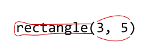

Getting started
===============

To build your first program in CodeWorld, type (or just click on) this
code:

~~~~~ . clickable
program = drawingOf(codeWorldLogo)
~~~~~

If you type this and click the **Run** button, you'll see a drawing of the
CodeWorld logo in the *canvas* on the right side of the screen.

!!! Warning: Did something go wrong?
    If you don't see the CodeWorld logo, don't worry.  You can fix it!

    Computers can be very picky, so make sure you have typed *exactly* what
    you see above.  That means everything needs to be spelled correctly, the
    same letters need to be capitalized, and you need parentheses just where
    they are.  There should be nothing else in your editor except that one
    line.

    When you make a mistake, the computer usually shows you an *error message*,
    which shows up on the right side of your screen in a pink shaded window.
    These messages tell you what went wrong.

    

    * If you see "not in scope", this means you have misspelled a word or
      used the wrong capitalization.
    * If you see "parse error", this can mean you've left out or have
      extra punctuation marks or symbols.

    Check your code carefully and try again.

Dissecting your first program
-----------------------------

If you have done coding before, you may have heard that code is like a recipe
that tells a computer step-by-step what to do.  In CodeWorld, though, code is
more like a *dictionary* or *glossary*. It tells the computer what words mean.

Here's the code you just wrote and what its parts mean.

    | `program`  | `=` | `drawingOf(` | `codeWorldLogo`     | `)` |
    |------------|-----|--------------|---------------------|-----|
    | My program | is  | a drawing of | the CodeWorld logo. |     |

* `program` is the **variable** that you're defining. A variable is a name for
  something.  Usually in math, variables are just one letter long and stand for
  numbers.  In CodeWorld, though, variables can name many different types of
  values: numbers, pictures, colors, text, and even whole programs.  Because
  you will use so many of them, you can name variables with whole words. 
  There are some rules for naming variables. Most importantly, they must start
  with a *lower-case* letter and cannot contain spaces.

!!! collapsible: Camel case
    Sometimes, you may want more than one word to name a variable!  Since variables cannot have spaces, you should leave them out and just run words together.  To make it easier to tell when a new word starts, you can capitalize the *second* and *later* words.

    

    In your first program, `drawingOf` and `codeWorldLogo` were written in
    this way.  It's often called **camel case**.  Why?  Because the variable
    name has humps!

* The **equal sign** means "is" and tells the computer that the two expressions mean the
  same thing. It is used to connect a variable with its definition.

* `drawingOf` is called a **function**.  You'll use functions a lot, and you'll
  learn more about them later!  This particular function, `drawingOf`, tells the
  computer that your program is a drawing.  Instead of playing a game or
  animation, it will just show a picture.

* `codeWorldLogo` is the specific picture your program will show.  Your
  computer already knows what the CodeWorld logo looks like, so this was an
  easy program to write.  Most of your own programs will need to describe
  the picture that you want to show in more detail.

Building a nametag
------------------

Of course, you can do a lot more in CodeWorld than just look at the CodeWorld
logo!  Next, you can build a digital nametag for yourself.  To do this,
you'll start by telling your computer that your program should be a drawing
of a nametag. Type (or just click on) this code:

~~~~~ . clickable
program = drawingOf(nametag)
~~~~~

**This program doesn't work!**  When you click the **Run** button, you should
see an error indicator on the left. Mousing over the indictaor you will see
the message: `Variable not in scope: nametag :: Picture`.
This is your computer telling you that it doesn't know what `nametag` means!

!!! Tip: Run your program often!
    Even though your code was not finished, it didn't hurt to click **Run**.
    You can think of error messages as being a conversation with your
    computer.  You're just asking what it needs next!

    In this case, `Variable not in scope` told you that you need to
    define `nametag`.  But if you typed something wrong, you might see
    a different message, like `Parse error` or `Couldn't match types`.
    These are clues that you have made a different mistake.  That's
    okay too.  The sooner you know about the mistake, the sooner you
    can fix it.

    Did you notice that your computer already told you that nametag is a
    picture?  It figured that out from context.  Because you asked for a
    *drawing* of `nametag`, it is expecting `nametag` to be a picture.
    This is just one more way the computer lets you know what it's thinking.

To finish your code, you'll need to define the variable `nametag`, and
describe to your computer exactly what a nametag is.  

To start, you can add your name, like this:

~~~~~ . clickable
program = drawingOf(nametag)
nametag = lettering("Camille")
~~~~~

You've used a new function: **`lettering`**.  This function describes a
picture with letters (or any other kind of text) on it.

Next, you can add a border to your nametag.  You might be tempted to add
a new line like `nametag = ...` to your code, but you can't! Remember,
your code is like a dictionary, and each definition in it should give
the whole definition for that word.  To include a second shape in your
nametag, you'll use an *operator*, **`&`**, which you can read as "and" or "in front
of". To describe the border itself, two more functions -- **`circle`**
and **`rectangle`** -- are useful.

Here's a name tag with a border:

~~~~~ . clickable
program = drawingOf(nametag)
nametag = lettering("Camille") & circle(4) & rectangle(8, 8)
~~~~~

Here are the shape functions you can use in your nametag, and the
**arguments** (the information inside the parentheses) that each one
expects.

| Function    | Expected arguments (inside parentheses)            | Example            |
|-------------|----------------------------------------------------|--------------------|
| `lettering` | Some text in quotation marks                       | lettering("Jenna") |
| `circle`    | A radius--the distance from the center to the edge | circle(7)          |
| `rectangle` | The width *and* height of the rectangle            | rectangle(5, 3)    |

Try these examples to learn more:

!!! : Concentric circles
    ~~~~~ . clickable
    program = drawingOf(nametag)
    nametag = lettering("Diego") & circle(4) & circle(5) & circle(6)
    ~~~~~

    The `circle` function needs only a single number, which is the *radius*
    of the circle.  Radius means the number of units from the center of
    the circle to the outside.

    
    
!!! : Nested rectangles
    ~~~~~ . clickable
    program = drawingOf(nametag)
    nametag = lettering("Alyssa") & rectangle(6, 2) & rectangle(7, 3)
    ~~~~~

    The `rectangle` function needs **two** numbers.  The first is how many
    units wide the rectangle should be, and the second is how many units
    tall it should be.

!!! : Overlapping rectangles
    ~~~~~ . clickable
    program = drawingOf(nametag)
    nametag = lettering("Karim") & rectangle(8, 2) & rectangle(7, 3) &
              rectangle(6, 4) & rectangle(5, 5)
    ~~~~~

    Notice how the definition of `nametag` got too long?  It's okay to
    start a new line, but you **must** indent the new line.  That is,
    leave some blank spaces at the beginning.  If you forget to indent,
    the computer will be confused and think you're defining a new
    variable.  This can cause a `Parse error` message.

Once you've understood these examples, try changing the numbers or making other changes.

What to do when you make a mistake
----------------------

As you experminent with your programs, you're likely to try a few things
that don't work.  

The error indicator and message on the left can help you figure out
what and where the error is. Keep in mind, however, the error is not always
on the same line as the indicator. This is just the point at which the computer 
says *I no longer understand what you are doing.*  

You may also see the error message on the right after clicking **Run**.
In this case, note the error message. But, more importantly, the *line and
column numbers*. For example, `Line 6, Column 36`. This is the exact
point at which the computer stopped understanding.

Regardless of the message, you can always click on the line and column
number next to an error message, and get straight to the location in
your code where the error was recognized.  (Remember. Sometimes your
actual mistake could be earlier!)  So just read over it and double-check
that you've typed what you intended from that point backwards.

Defining variables
------------------

In the nametags above, you defined *variables* called `program` and `nametag`.
Because your code is like a dictionary or glossary, you can define as many
variables as you like. 

For example, you might write:

~~~~~
name = "Han"
age = 14
favoriteColor = blue
~~~~~

!!! Warning
    This isn't a complete program!  If you try to run this example, you will see
    an error message:

    `The variable program is not defined in your code.`

    More on that later!

Each of these is a type of **equation**, which says assign the value on the right to the name on the left. You have seen this type of equation in math, often with variables x and y. For example, in math, you might see x=10 and y=20.

When you define a variable, you can use it in the rest of your code. 

Look at this example:

~~~~~ . clickable
program = drawingOf(nametag)
nametag = lettering(name) & circle(4)
name = "Guiseppe"
~~~~~

This code says that your program is a drawing of a nametag, that a nametag
contains lettering of the name, and that the name is "Guiseppe".  So
"Guiseppe" is written on the name tag.

!!! Warning
    Don't put quotes around a variable!
    This code includes the expression `lettering(name)` **without**
    quotation marks.  What would happen if you write `lettering("name")`
    with the quotation marks?  You'd see a nametag with the word "name"
    written on it.  Oops!

    Quotation marks tell the computer *not* to interpret something as code,
    but only as a piece of text.  Variables are code, and you never put
    quotation marks around your code.

You'll want to remember that defining a variable doesn't do anything by itself.
Suppose you wrote this code:

~~~~~ . clickable
program = drawingOf(nametag)
nametag = lettering("Chris")
border = circle(5)
~~~~~

If you run the code, you might be surprised to find there is no border!
You've told your computer what the word `border` means, but you didn't
say you wanted to use it in your program!  

You might try this instead:

~~~~~ . clickable
program = drawingOf(nametag)
nametag = lettering("Chris") & border
border = circle(5)
~~~~~

That extra `& border` tells your computer that you actually *want* a
border in the name tag.  Defining it isn't enough.

### The `program` variable

Remember that defining a variable doesn't do anything by itself.  But your
code is nothing but a bunch of definitions, just like a glossary or
dictionary! Then how does your code make any difference at all?

The answer lies in a special variable called `program`.  Every CodeWorld
project needs *exactly one* definition for the `program` variable.
This is where the computer will look for a description of the program it
should run.  Sometimes, like in the very first program you wrote, this
is the only definition you need.  But usually you will use other
variables that the computer doesn't know *in* your definition of
`program`. When it sees these new words, the computer will look them up
as well.  If their definitions use more words the computer
doesn't know, it will look up *those* words, and so on.

Remember: a definition only matters if the variable you're defining is
*used*, either directly or indirectly, in the definition of `program`.
That is, in the definition of `program`, or the definition of another
variable that's used in the definition of program, and so on.

!!! Tip: Warnings
    When you write code that is correct, but could be improved, you will
    sometimes see a *warning*.  This is a message in the message area
    that lets you know about a problem, even though your program runs.

    One warning you might see is `defined but not used`.  This warning
    tells you that you've defined a variable, but it's not necessary,
    because it isn't used (directly or indirectly) in the meaning of
    that special `program` variable.

All about functions
-------------------

All of the code you've written so far has made use of functions.  These are
important tools you'll be using very often in your coding. 
Let's investigate them in more detail.

> A **function** is a relationship that associates each possible argument or input with a
> specific result or output.

**************************************************
*    input     .----------.     output
*      o------>| function +------>o
* (arguments)  '----------'    (result)
**************************************************

The type of input a function expects is called its *domain*, and the type of
result it produces is called its *range*.  

Here's a list of the functions you've used so far, with their domains and ranges.

Function    | Domain             | Range
------------|--------------------|---------
`drawingOf` | `Picture`          | `Program`
`lettering` | `Text`             | `Picture`
`circle`    | `Number`           | `Picture`
`rectangle` | `(Number, Number)` | `Picture`

(In addition to this, **`&`** is a binary operator.  It's a kind of
function, too, but it looks different because it is a symbol rather than
a name.)

**Applying** a function means using the function to describe its result for
a specific input.  To apply a function to some input, you write the name of
the function, an open-parenthesis, the input values (called **arguments**),
and then a close-parenthesis.  When there is more than one argument to a
function, you can write the domain in CodeWorld by listing them all in
parentheses, separated by commas, like you see in `rectangle` in the table
above.

!!! Tip
    Parentheses always come in pairs and are used like a ring around the
    arguments to a function.  Picture the name of the function at the beginning as
    adding a handle to that ring, forming something like a frying pan.

    

    Go over some of the programs you've written up to this point and see if you
    can see the frying pans for each function that you've used.

### Exploring available functions

The way that you use a function in your code will depend on its domain and range.
There's a type of short notation that's useful for stating the domain and range
of a function.  It looks like this:

~~~~~
drawingOf :: Picture -> Program
lettering :: Text -> Picture
circle :: Number -> Picture
rectangle :: (Number, Number) -> Picture
~~~~~

These lines, called **type signatures**, don't *define* the functions; they
just provide a little bit of information about what arguments they need
and what type of results they have.  The two colons (**`::`**) should be read as
"has the type", while the arrow (**`->`**) denotes a *function* from one
kind of thing to another.  So, the first line says "`drawingOf` has the type
"function from picture to program".

You can explore all of the functions the computer already knows when you
use CodeWorld by pressing Shift-Space or Ctrl-Space on a blank line in the
CodeWorld editor.  Try it!  The list gives all the names your computer
already knows, and there are a lot of them!  By typing the first few
letters of the function you want, you can narrow down the list.  The type
signatures tell you what types of information you need to provide to apply
the function and what type you can expect to end up with.

**Important**: The names of functions are *reserved*. That means you cannot use them as variable names. You would not be able to write program like this:

program=drawingOf(circle)
circle=circle(5)

Wherease this would be okay:

program=drawingOf(myCircle)
myCircle=circle(5)

For practice, see if you can write code using each of the following
functions.  Start by looking up their domain and range, using Shift-Space or
Ctrl-Space, and see if you can use them with just that hint.  If you need
more hints, expand the sections below for an example and explanation.

!!! collapsible: `solidCircle`
    ~~~~~
    solidCircle :: Number -> Picture
    ~~~~~

    This type signature tells you that the only argument of `solidCircle`
    is a number and that the result is a picture.  

    Here's an example of a program that uses `solidCircle`.

    ~~~~~ . clickable
    program = drawingOf(pic)
    pic = solidCircle(5)
    ~~~~~

    You might have noticed that even though the type signature tells you
    the input is a number, it doesn't tell you what that number means!
    Type signatures just tell you the *types* of arguments needed to use
    the function, not their meaning.  If you experiment, you may discover
    that the argument is the radius of the circle.

!!! collapsible: `solidRectangle`
    ~~~~~
    solidRectangle :: (Number, Number) -> Picture
    ~~~~~

    This type signature tells you that `solidRectangle` needs two
    arguments, both of them being numbers, and the result is a picture.  
    
    Here's an example of a program that uses `solidRectangle`.

    ~~~~~ . clickable
    program = drawingOf(pic)
    pic = solidRectangle(7, 3)
    ~~~~~

    The first number is the width of the rectangle, and the second
    number is the height.

!!! collapsible: `thickCircle`
    ~~~~~
    thickCircle :: (Number, Number) -> Picture
    ~~~~~

    This type signature tells you that `thickCircle` needs two arguments,
    both of them being numbers, and the result is a picture.  
    
    Here's an example of a program that uses `thickCircle`.

    ~~~~~ . clickable
    program = drawingOf(pic)
    pic = thickCircle(5, 1)
    ~~~~~

    Functions beginning with "thick" draw shapes with a thick line.  As a
    general rule, the arguments to these functions are the same as the
    arguments for the non-`thick` function, along with one extra argument
    for the thickness of the line.  In this case, the first argument to
    `thickCircle` (just like the first argument to `circle`) is the radius.
    The second argument is the line thickness with which the circle is
    drawn.

!!! collapsible: `thickRectangle`
    ~~~~~
    thickRectangle :: (Number, Number, Number) -> Picture
    ~~~~~

    This time, the type signature tells you that `thickRectangle` needs
    three arguments, a new record!  All three arguments are numbers, and
    the result is a picture.  
    
    Here's an example of a program that uses 'thickRectangle`.

    ~~~~~ . clickable
    program = drawingOf(pic)
    pic = thickRectangle(8, 4, 1)
    ~~~~~

    The first two arguments are the width and height of the rectangle.
    The third and final argument is the thickness of the line to draw it
    with.

!!! collapsible: `codeWorldLogo`
    ~~~~~
    codeWorldLogo :: Picture
    ~~~~~

    This was a trick question: `codeWorldLogo` isn't a function at all!
    It still has a type signature, but there is no arrow, because it's
    just a picture.  That means there are no parentheses after it, and it
    has no arguments.

    ~~~~~ . clickable
    program = drawingOf(pic)
    pic = codeWorldLogo
    ~~~~~

    This is the same program as the very first one you wrote!

As you continue with CodeWorld, you'll learn a few more functions.  For
now, see if you can spruce up your nametag with some thicker lines.
Try some solid shapes too and think about whether they are useful for
creating your nametag.

Transformations
===============

The nametags you built in the last section were pretty cool!  Still, they
had some big limitations.  First, they were black and white.  Colors would
make them much more exciting.  Second, all the shapes were in the
center of the screen.  You can fix both of these problems using
*transformations*.

A **transformation** is a function that turns one picture into a different
one.  It receives as its arguments:

1. a picture called the **preimage**
2. more arguments describing what to chage about it

The result of the transformation is a *new* picture, which is like the
preimage except for that change.

*************************************************
*               .----------------.
* preimage o--->|                |
*               | transformation +---->o result
* changes o---->|                |
*               '----------------'
*************************************************

You can use transformations to make several kinds of changes to your
pictures.  Here, we will look at five different transformations: coloring,
translation, rotation, dilation, and scaling.

Coloring
--------

The first transformation you will use is coloring.  The `colored` function
changes (transforms) the color of a picture. This function expects two arguments: the preimage, and a new color.  The colors of the preimage don't matter at
all -- only the shapes involved.  The result of the `colored` function is a new
picture, which is just like the preimage, except for the different color. It has been transformed!

~~~~~ . clickable
program  = drawingOf(redWheel)
redWheel = colored(wheel, red)
wheel    = solidCircle(4)
~~~~~

Try that out.  To help you understand it, let's take a closer look at this
program by asking and answering a question.

!!! collapsible: What does the picture named `wheel` look like?
    It's a filled-in circle of radius 4, drawn in **black**.

    
<iframe src="https://code.world/run.html?mode=codeworld&dhash=DrYNeySBqPKubPkzT48dTEA" width=250 height=250 style="border: none;"></iframe>

    Surprised?  If so, this is a good chance to review what a
    transformation does and doesn't do.  The equation
    `redWheel = colored(wheel, red)` defines a variable called
    `redWheel`, which is a picture that is just like `wheel`, except
    drawn in red.  The new variable, `redWheel`, is colored red like
    you expected, but that *doesn't* change the meaning of the other
    variable, `wheel`.  Remember that `redWheel` and `wheel` are
    different pictures.

    The final program draws a wheel in red, because you defined the
    **program** to be a drawing of `redWheel`.

    Can you guess what the result of this code is?

    ~~~~~ . clickable
    program  = drawingOf(wheel)
    redWheel = colored(wheel, red)
    wheel    = solidCircle(4)
    ~~~~~

    If you ran this, you would see a black circle. `redWheel` is still
    defined to be a red circle.  However, `program` is defined to be a
    drawing of `wheel`, which is still black.

When you use `colored` in a program, a *whole expression* like
`colored(pic, blue)` describes a picture, so you can use an expression
like this in all the same places you could use any other description of
a picture.  

For example, you might define `nametag` like this:

~~~~~ . clickable
program = drawingOf(nametag)

nametag = colored(outerBorder, blue) &
          colored(innerBorder, green) &
          colored(name, red)

outerBorder = thickRectangle(15, 15, 1)
innerBorder = thickCircle(6, 1)
name        = lettering("Winona")
~~~~~

Since `colored(outerBorder, blue)` is an expression that describes a
picture, you can combine it with other pictures using **`&`**, just
like you could with `circle(5)`, `rectangle(3, 4)`, or any other
picture expression.

Here is a table of colors you can use.

|            |            |            |            |
|------------|------------|------------|------------|
| red        | yellow     | green      | blue       |
| orange     | purple     | pink       | brown      |
| white      | black      | gray       |            |

!!! Tip
    Why would you ever use the color `white`, when the background
    color in CodeWorld is already white?

    Although the background in CodeWorld starts out white, you can
    use a large colored shape to change the background to some other
    color.  Then a white shape in front of that color would be
    visible.

    ~~~~~ . clickable
    program  = drawingOf(nametag)
    nametag  = colored(label, white) & colored(backdrop, purple)
    label    = lettering("Hashim")
    backdrop = solidRectangle(20, 20)
    ~~~~~

    If you do this, remember that **`&`** means "in front of", so
    the shape in front should come first, while your backdrop should
    come last.

Translation: Moving
-------------------

The second transformation you can use in your programs is translation.  The
`translated` function shifts a picture up, down, left, or right.  Its inputs
are the preimage, and two distances to move the picture.  The result of the
`translated` function is a new picture with the same content as the preimage, but
shifted either horizontally (that is, left or right) or vertically (that is,
up or down) or both.

When you give distances to the `translated` function, you will list the
horizontal change first, and the vertical change second.  

A useful tool for finding these numbers is the **coordinate plane**.

!!! Tip: Get your own coordinate plane
    The coordinate plane is a picture that your computer knows about in
    CodeWorld.  
    
    To make your own coordinate plane, use this code:

    ~~~~~ . clickable
    program = drawingOf(coordinatePlane)
    ~~~~~

This tool is a combination of two number lines.

1. The first number line is the *x* *axis*.  It is *horizontal*, with positive 
   numbers to the right and negative numbers to the left.  You can use this line  
   to describe how far left or right to move a picture. 
2. The second number line is the *y* *axis*.  It is *vertical*, with positive 
   numbers on top and negative numbers on the bottom.  You use this number 
   line to describe how far up or down to move a picture.

The basic shapes you have learned are drawn with their center at the *origin* --
the point (0, 0) -- on the coordinate plane, so you should measure your x
and y distances from there.  As you define your own pictures, it's a good
idea to continue this practice.

To see a circle with radius 5 drawn on the corrdinate plane, use this code:

    ~~~~~ . clickable
    program = drawingOf(coordinatePlane & circle(5))
    ~~~~~

Suppose you wanted a circle representing the sun in the top left
corner of the screen.  First, you could look at the *x* *axis*,
and see that negative numbers are used to move a shape to the left.  You might
pick -5, which is five units left on the screen.  Next, you could look at the
*y* *axis*, and see that positive numbers are used to move an object
up.  You might pick 7, which is most of the way to the top of the screen.

The expression describing a picture of the sun in the right place is now
`translated(sun, -5, 7)`.  The first argument is the preimage, which you
would define elsewhere in the program.  The second and third arguments are
the distances to move the shape in your new picture, with horizontal first,
then vertical.

Here is a complete program:

~~~~~ . clickable
program = drawingOf(pic)
pic = translated(sun, -5, 7)
sun = solidCircle(2)
~~~~~

!!! collapsible: What if you only wanted to move the preimage to the side?
    Functions always need the same number of arguments!  The `translated`
    function expects three of them, so you *must* give all three arguments
    to use it.

    If you only want to move the preimage in one direction, use zero (`0`)
    for the other direction.  For example, `translated(sun, 0, 5)` describes
    the sun at midday.  It has still been moved up, but not at all to the
    right or left, because the second argument is zero.

!!! collapsible: What does `translated(pic, 0, 0)` mean?
    Just for fun, what happens if you use zero for both distances?  Think
    about it!

    If you do not move the picture in either direction, then the result is
    the same as the preimage!  That is, `translated(pic, 0, 0)` is another
    expression that describes the same picture as `pic`.  It makes no
    difference to the computer which expression you use.

Transformation practice
-----------------------

You now know seven different functions for building shapes, and two
transformations.  Your CodeWorld vocabulary is growing.  Here's a summary
of what you've seen so far.

Basic shapes:
~~~~~
circle :: Number -> Picture
solidCircle :: Number -> Picture
thickCircle :: (Number, Number) -> Picture
rectangle :: (Number, Number) -> Picture
solidRectangle :: (Number, Number) -> Picture
thickRectangle :: (Number, Number, Number) -> Picture
lettering :: Text -> Picture
~~~~~

Transformations:
~~~~~
colored :: (Picture, Color) -> Picture
translated :: (Picture, Number, Number) -> Picture
~~~~~

And a couple plain pictures:
~~~~~
codeWorldLogo :: Picture
coordinatePlane :: Picture
~~~~~

Using these building blocks, you can build your own creative pictures.
Coloring and moving shapes really opens up the possibilities.  You might
try:

* Using more solid shapes, now that they aren't stuck covering the center
  of your picture.  You can color them and move them around.
* Placing a large solid colored shape, a backdrop, behind your picture
  (using **`&`**) to change the background color.  Remember that when you
  use **`&`**, the first picture goes in front, so keep your backdrop at
  the end!
* Even applying more than one transformation--such as a coloring and a
  translation, starting from one preimage.

You will define a lot of variables as you work.  To draw a sunset, you
might write something like this.

~~~~~ . clickable
program = drawingOf(sunset)

sunset = translated(greenGround, 0, -5) &
         translated(orangeSun, 0, 2) &
         blueSky

orangeSun = colored(sun, orange)
sun = solidCircle(3)

greenGround = colored(ground, green)
ground = solidRectangle(20, 10)

blueSky = colored(sky, blue)
sky = solidRectangle(20, 20)
~~~~~

See if you can describe exactly what each name means, and then check
your answer by changing the definition of program to draw that variable
by itself.  Understanding the meaning of each of your variables is how
you get better at programming!

!!! Note: Challenge -- Make your own emoji!
    Using your skills, can you invent your own emoji?  Try a solid
    yellow circle for the face, and then arrange smaller circles and
    rectangles for eyes, a nose, and mouth, and anything else you
    like!  Rectangles for hair?  Circles for glasses?  Go wild!

Rotation: Turning
-----------------

The next transformation to try is turning a picture.  Turning is also
called **rotation**, so this third transformation is done with the `rotated`
function.  The `rotated` function needs two arguments: the preimage, and an
angle to rotate (or turn) it.  Because `rotated` is a transformation, the
result is a new picture that is just like the first, except that it has
been rotated.

To guide yourself in thinking about rotations, imagine a protractor, like
this one.

As you can see, a fourth of a turn is 90 degrees, and half a turn is
180 degrees.  Positive angles represent turning the picture counterclockwise.
To turn the picture clockwise instead, use a negative angle.

!!! Warning
    It might seem a bit backwards that **counterclockwise** turns are
    represented by positive angles.  Yet, this is how mathematicians
    usually measure angles.  Pay attention, and don't let it fool you.

If you think about it, a diamond could just be a square, turned a bit to the
side so that its edges are diagonal.  Here's some code that describes a
diamond in this way.

~~~~~ . clickable
program = drawingOf(diamond)
diamond = rotated(square, 45)
square  = solidRectangle(4, 4)
~~~~~

You can probably think about a lot of other pictures you can draw using
rotated rectangles, lettering, and more.

!!! collapsible: What happens if you rotate a circle?
    If you rotate a circle, you won't notice any difference at all!  That's
    because a circle looks the same in all directions.  Mathematicians
    would say that a circle has *rotational symmetry*.  What that means to
    you is that you should save your rotations for shapes where it matters!

!!! collapsible: Can you rotate *and* translate a picture?
    Yes, but the result might surprise you!

    When you rotate a picture, it's rotated around the *center* of the
    picture.  Translation can move the shapes away from the center.  Consider
    this code.

    ~~~~~ . clickable
    program = drawingOf(rotatedBox)
    rotatedBox = rotated(translatedBox, 60)
    translatedBox = translated(box, 7, 0)
    box = solidRectangle(2, 2)
    ~~~~~

    
<iframe src="https://code.world/run.html?mode=codeworld&dhash=DTtRwAtzs4VAQep7g74-9dQ" width=250 height=250 style="border: none;"></iframe>

    Are you surprised to see the box way up near the top of the screen,
    when it was only translated to the right?  The explanation is that the
    picture `translatedBox` was rotated around its *center*, but the box
    itself is at the edge.  The diagram below might help to understand what
    happened.

    
<iframe src="https://code.world/run.html?mode=codeworld&dhash=D3uSuTWTC5QgGdXMrh290uA" width=250 height=250 style="border: none;"></iframe>

    To avoid this, consider rotating the shape first, and then translating
    the rotated shape.

    ~~~~~ . clickable
    program = drawingOf(translatedBox)
    rotatedBox = rotated(box, 60)
    translatedBox = translated(rotatedBox, 7, 0)
    box = solidRectangle(2, 2)
    ~~~~~

Reflection: Flipping
--------------------

Another transformation that you can use is reflection, which flips the
picture over some line.  The resulting picture is backwards, as if viewed
as a reflection in a mirror.  This transformation is done with the
`reflected` function.  This function needs two arguments: the preimage,
and an angle for the line of reflection (the line you're reflecting the
picture across).

Use the same protractor as you did for reflections to choose an angle for
the line of reflection.  For example:

| Angle | Effect                                                                  |
|:-----:|-------------------------------------------------------------------------|
|  `0`  | Line of reflection is horizontal; picture flips top to bottom.          |
|  `90` | Line of reflection is vertical; picture flips left to right.            |
|  `45` | Line of reflection is diagonal; picture flips top-left to bottom-right. |

You can use this to draw the CodeWorld logo backwards, like this:

~~~~~ . clickable
program = drawingOf(backwardLogo)
backwardLogo = reflected(codeWorldLogo, 90)
~~~~~

!!! collapsible: Why does the picture flip horizontally when the angle is 90 degrees?
    On the protractor, the 90 degree mark points up.  You might be surprised that the
    picture flips horizontally, not vertically!

    The key to this puzzle is that the angle defines the *line* *of* *reflection*.
    The picture flips *across* that line.  So if the line of reflection is vertical,
    then the picture will flip from left to right.

    This animation shows the line of reflection and the flipping, and may clear it up.

    
<iframe src="https://code.world/run.html?mode=codeworld&dhash=DkVZbEJpBVW64qwAGbfamGg" width=250 height=250 style="border: none;"></iframe>

!!! Note: Translation, rotation, and reflection make *congruent* pictures.
    In geometry, two shapes are called *congruent* if they have the same side
    lengths and angles, but might differ in the location or orientation of the
    image.  All of the last three transformations: translation, rotation, and
    reflection, produce congruent pictures.  In fact, these are all of the
    transformations you ever need to turn an image into any other image that's
    congruent to it.

Dilation: Resizing
------------------

Yet another transformation is used to change the size of a picture.
Changing size is also called **dilation**, so this transformation is done
with the `dilated` function.  This function needs two arguments: the
preimage, and a scale factor.  The scale factor says how much larger or
smaller the result should be.  For example:

| Scale Factor   | Result                   |
|:--------------:|--------------------------|
|      `2`       | Twice as large           |
|      `3`       | Three times as large     |
| `1/2` or `0.5` | Half the size            |
| `1/5` or `0.2` | One fifth the size       |
|      `1`       | The same as the preimage |

Here is an example of a program using the `dilated` function.

~~~~~ . clickable
program = drawingOf(poem)
poem = translated(firstLine, 0, 1) & translated(secondLine, 0, -1)
firstLine = dilated(asBig, 5)
secondLine = dilated(asAMouse, 1/2)
asBig = lettering("AS BIG")
asAMouse = lettering("as a mouse")
~~~~~

Some functions you've used to build shapes--like `rectangle` or
`circle`--already have arguments you can use to control their size.
It makes no difference whether you use the `dilated` function to resize
these shapes, or just build the picture larger in the first place.  So
`circle(6)` is the same picture you'd get by dilating `circle(3)` by a
scale factor of 2, and `rectangle(1, 2)` is the same picture you'd get
by dilating `rectangle(2, 4)` by a scale factor of one half.  But other
functions, like `lettering`, don't give you the same choices.  If you want
smaller or larger letters, `dilated` is the way to go.  As you build up
other more complicated pictures, dilation also comes in handy to resize
the whole picture at once, so you don't have to change each piece
separately.

!!! collapsible: How does dilation combine with rotation and translation?
    Rotation and dilation are independent of each other.  In other words,
    if you rotated and then translate a shape, you get the same result as
    translating and then rotating.

    Some extra care is needed to combine dilation with translation, though.
    Just like rotation always rotates around the *center* of a picture,
    dilation always resizes away from or towards the *center*.  That means
    shapes in the center of a picture remain in the center, but a shape
    that is away from the center is pushed further away from (if the picture
    is getting larger), or pulled toward (if the picture is getting smaller)
    the center.

!!! collapsible: What happens if you dilate by a negative number?
    Dilating by a negative scale factor reflects your picture across the
    origin, (0, 0); meaning that each point on your picture moves to the
    opposite side of the origin.  This is actually the same as turning your
    picture upside down!  In other words, `dilated(pic, -1)` is always the
    same picture as `rotated(pic, 180)`.

!!! collapsible: What happens if you dilate by zero?
    Dilating by a scale factor of zero makes your picture disappear!  Think
    of dilation as being like multiplication.  If you dilate by 1 (just like
    if you multiply by 1), you don't change the picture at all.  If you
    dilate by 0 (just like if you multiply by zero), the whole picture goes
    away, and you have nothing left.

    This is different from rotation or translation, which are are like
    adding, rather than multiplying.  Rotating or translating by 0 doesn't
    change the picture.

!!! Note: Translation, rotation, reflection, and dilation make *similar* pictures.
    In geometry, two shapes are called *similar* if they have the same angles
    between sides, but might differ in the distances, location, or orientation
    of the image.  This is a weaker statement than being congruent: congruent
    shapes are also the same size, while similar shapes can be different sizes.
    All of the last four transformations: translation, rotation, reflection, and
    dilation, produce similar pictures.  In fact, these are all of the
    transformations you ever need to turn an image into any other image that's
    similar to it.

Scaling: Stretching
-------------------

Scaling is used to stretch or flip a picture.  The `scaled` function needs three
arguments: the preimage, and two different scale factors in the horizontal and
vertical directions.  If the two scale factors are the same, then scaling is
just like dilation.  But when they are different, scaling lets you stretch a
picture in one direction more or less than the other.

~~~~~ . clickable
program = drawingOf(ellipse)
ellipse = scaled(base, 2, 1/2)
base    = solidCircle(4)
~~~~~

This program shows a drawing of an ellipse, which is just a stretched-out
circle.  You can also stretch other shapes, and even letters and other
pictures that you define yourself.

!!! collapsible: How are the scale factors different between `scaled` and `dilated`?
    The scale factors in the `scaled` function work much the same way as they
    do for `dilated`--just in one direction at a time.  A scale factor of 0
    still produces a blank picture, and 1 still leaves the picture
    unchanged.  Numbers larger than one stretch the picture larger, and
    numbers smaller than one squishes the picture to be smaller than the
    preimage.

    For any values of `pic` and `k`, `dilated(pic, k)` is the same as
    `scaled(pic, k, k)`.  The extra power of the `scaled` function is that
    you can choose different scale factors in different directions.

!!! collapsible: What happens if you scale by a negative number?
    A negative scale factor in one direction will *reflect* the preimage in
    that direction.  In other words, `scaled(pic, -1, 1)` is the same as
    `reflected(pic, 90)` (it reflects across the y axis), and `scaled(pic, 1, -1)`
    is the same as `reflected(pic, 0)` (it reflects across the x axis).

    If you scale by a negative scale factor in both directions, this reflects
    across the x and y axes at the same time.  This is sometimes called a
    reflection across the origin.  It's also the same as rotation by 180
    degrees.  You can try this with a card or slip of paper: if you flip it
    horizontally, then flip it again vertically, it ends up in the same
    position as if you'd turned it 180 degrees.

!!! Note: The `scaled` function doesn't produce congruent or similar shapes.
    Unlike the earlier transformations, scaled pictures are not necessarily
    *either* congruent or similar to the preimage.  They can be, but only if
    the magnitudes of the scale factors are the same.

Expression structure
====================

You've now seen many of the basic functions you need to describe pictures
with mathematics, and draw them in CodeWorld.  In this section, you will
learn more about how these pieces fit together to build artwork that is as
elaborate and complex as you like.

Expressions and types
---------------------

You have been using expressions already, as you wrote your first code.
An **expression** is the code or notation you use to describe a value
such as a picture, number, color, or program.  Here are some examples of
simple expressions.

| Expression               | Type of value |
|--------------------------|:-------------:|
| `drawingOf(nametag)`     | Program       |
| `codeWorldLogo`          | Picture       |
| `circle(4)`              | Picture       |
| `translated(sun, -5, 7)` | Picture       |
| `colored(wheel, red)`    | Picture       |
| `circle(8) & circle(9)`  | Picture       |
| `blue`                   | Color         |
| `1/2`                    | Number        |
| `2`                      | Number        |
| `"Sofia"`                | Text          |

Every expression has a type, which is the kind of thing that it
describes.  The simple types you've worked with so far include
`Program`, `Picture`, `Color`, `Number`, and `Text`.  These types
are used in the domain and range of the functions you use for
programming.

To learn more about the kinds of expressions you can write in
CodeWorld, explore the topics below.

!!! collapsible: Literal expressions
    For some types, like numbers, text, and colors, you can write
    values directly as a simple kind of expression.  These are
    called **literal** expressions.

    Literal expressions for numbers can be whole numbers, like
    `5` or `-1`, or they can be decimals, like `1.5` or `3.14`.
    You can also write fractions, like `1/2`, as just a number,
    too, although this isn't *exactly* a literal; it's actually
    dividing two other numbers.

    Text also has literal expressions.  A literal expression for
    text is written in quotation marks.  Your name, in the nametag
    program you wrote earlier, is an example.

    Finally, common color names like `blue` and `green` are
    literal expressions, too.

!!! collapsible: Variables
    A variable is another kind of expression.  Variables are
    names the computer already knows, or that you have defined
    elsewhere, that represent a value.  Some of the variables
    you have used as expressions are `codeWorldLogo` (which is
    a known picture) or `nametag` (a picture that you defined
    elsewhere in the program).

    Most of the time, variables that are already known to the
    computer act about the same as literal expressions.  As you
    learn more advanced techniques, the difference will become
    important.  In CodeWorld, you can always tell the
    difference because variables start with lower-case letters.
    (In mathematics outside of CodeWorld, variables are mostly
    lower-case letters, too, but it's not a hard and fast rule.)

!!! collapsible: Function applications
    Most of the expressions you've written so far have been
    function applications.  These expressions are written with
    the name of a function to apply, followed by parentheses,
    and inside the parentheses the arguments for that function.
    The value described by the whole expression is the *result*
    of that function when it's given those arguments.

!!! collapsible: Operations
    Finally, you've written some expressions that are operations.
    Some operations are `2 + 2`, or `codeWorldLogo & coordinatePlane`.
    An operation is written with the first value at the beginning,
    an operator in the middle, and a second value at the end.  You
    can continue and chain more operations at the end as well, as
    in `5 + 4 + 3 + 2 + 1`, or `circle(1) & circle(2) & circle(3)`.

    You know some operators on numbers from your mathematics
    studies.  These include addition (written as `+`),
    subtraction (written as `-`), multiplication (written as
    `*`), and division (written as `/`).  These work for numbers
    in CodeWorld just as they do for numbers in mathematics.
    That also means they follow the order of operations, and
    you can use parentheses when needed to communicate how to
    group the operations together.

    The other operator you've used a lot is `&`, the "in front
    of" operator for pictures.  Even though the values you combine
    are pictures instead of numbers, the `&` operator works in
    pretty much the same way as the operations you know on
    numbers.

Nesting expressions
-------------------

You might notice that many of the expressions in the table above
have other expressions inside of them.  For example, `circle(8)`,
an expression for a picture, uses `8`, an expression for a number,
inside.  In fact, this happens all the time.  Most expressions are
made of other, smaller expressions, much like how Russian nesting
dolls have other smaller dolls inside.

Just like with the dolls, this is called **nesting**.  Up until now,
your programs haven't used too many nested expressions.  Instead, if
you wanted to apply several transformations to the same basic shape,
you have named all of the partially transformed shapes, so that can
refer to them in the next equation.  Here's a quick reminder how you
might define a diamond by naming the simpler pictures it is
transformed from.

~~~~~ . clickable
program = drawingOf(diamond)
diamond = rotated(square, 45)
square  = solidRectangle(4, 4)
~~~~~

Naming everything like that can be tedious, though.  If you have a
simple shape, such as `rectangle(2, 2)`, you may not want to bother
giving it a name.  You can just describe the shape right where the
name would go, instead.

That looks like this:

~~~~~ . clickable
program = drawingOf(diamond)
diamond = rotated(rectangle(2, 2), 45)
~~~~~

Or even this:

~~~~~ . clickable
program = drawingOf(rotated(rectangle(2, 2), 45))
~~~~~

Careful, though!  You can avoid naming simple things, but if you
nest too much, you get parentheses inside of parentheses inside of
parentheses, and pretty soon it's hard to tell what's going on!

Nesting can be used for numbers, too.  You can let the computer work out
math for you on numbers, too.  When you write math expressions, you can
use `+` and `-` the way you normally would.  To multiply, use `*`.  To
divide, use `/`.

Check out this code:

~~~~~ . clickable
program = drawingOf(design)
design  = rotated(rectangle(4, 0.2), 1 * 180 / 5)
        & rotated(rectangle(4, 0.2), 2 * 180 / 5)
        & rotated(rectangle(4, 0.2), 3 * 180 / 5)
        & rotated(rectangle(4, 0.2), 4 * 180 / 5)
        & rotated(rectangle(4, 0.2), 5 * 180 / 5)
~~~~~

We could have written `36`, '72', '108', '144', and `180`, instead of
writing math expressions for the angles.  But this way, it's very
clear what we are doing: dividing 180 degrees into fifths, and then
rotating a rectangle by each amount.  And we don't have to worry
about getting your arithmetic wrong!

Just like in math, you can use parentheses to group expressions, so
`3 * (6 - 2)` is `3 * 4`, which is `12`.

Parenthesis matching
--------------------

Many of the expressions you write will use parentheses -- "(" and ")" --
to group their parts.  There are parentheses in all function applications,
but they can also be used to group operators.  These parentheses are the
key to understanding the structure of your code.  They *always* come in
matching pairs -- one open-parenthesis always goes with a matching close
parenthesis -- and help divide up your code into logical parts.

As you nest expressions deeper, though, it becomes more challenging to
match up these parentheses.

!!! collapsible: `Parse error: Are you missing a parenthesis?`
    This is one error you may get if your parentheses do not
    match. The part telling you the line and column can
    help you track where the computer noticed the error.

    That, along with the information in this section, can help you
    track down the mismatch.  
    
    If you wrote this, with a missing right parenthesis after the 5,
    you would get the error:

    ~~~~~
    program = drawingOf(colored(circle(5 & rectangle(1, 2), blue))
    ~~~~~

    Notice that often the computer does not catch it until the
    end of the program.

!!! collapsible: `Parse error on input`
    This is another error you may get if your parentheses do not
    match. This one is often caused by a missing left parenthesis.

    If you wrote this, with a missing left parenthesis before the 5,
    you would get the error:

    ~~~~~
    program = drawingOf(colored(circle 5) & rectangle(1, 2), blue))
    ~~~~~

    Notice that often the computer does not catch it until the
    end of the program.

A good way to start matching parentheses is to look at each pair as making
a ring around the code inside them.  If you write the expression on paper,
you can complete the ring by joining the edges of the parentheses.  You
want to do this without crossing the lines.

For instance, these two pair of parentheses:

~~~~~
(   )  (   )
~~~~~

can be completed into these rings:

*****************
*   .-.    .-.
*  (   )  (   )
*   '-'    '-'
*****************

These nested parentheses:

~~~~~
(  (   )  (   )  )
~~~~~

can be completed to form these nested rings:

***********************
*   .--------------.
*  |   .-.    .-.   |
*  |  (   )  (   )  |
*  |   '-'    '-'   |
*   '--------------'
***********************

For harder cases, there are a few strategies worth knowing for
keeping track of parentheses: matching from the **inside out**,
**counting**, **wrapping** expressions, and using your **tools**.

### Inside-out matching

Matching from the inside out is the easiest strategy to match up all
the parentheses in an expression.  Look at these deeply nested
parentheses:

~~~~~
(   )  (  (   )  (  (   )  )  )
~~~~~

It may not be apparent which parentheses match at a glance.  But
you can certainly match some: the parentheses that face each other
with no other parentheses in between must match:

************************************
*   .-.       .-.       .-.
*  (   )  (  (   )  (  (   )  )  )
*   '-'       '-'       '-'
************************************

With those matches out of the way, it's easy to see more pairs of
parentheses that face each other with no *unmatched* parentheses
between them.  If you keep matching what you can in this way, you
will eventually complete the match:

************************************
*          .--------------------.
*         |          .-------.   |
*   .-.   |   .-.   |   .-.   |  |
*  (   )  |  (   )  |  (   )  |  |
*   '-'   |   '-'   |   '-'   |  |
*         |          '-------'   |
*          '--------------------'
************************************

When using this strategy, you will draw the smallest rings first,
and then fill in the larger rings around them.

### Parenthesis counting

The counting strategy is better when you want to find the match
for a specific parenthesis.  Starting from an open-parenthesis, you
will scan forward, counting how many more close-parentheses you
need before you've found its match.  Each open-parenthesis you find
increases the count by one, while each close-parenthesis decreases
the count by one.  When you reach zero, you've found the match.

Suppose you wanted to find the match for the first parenthesis in
this sequence:

~~~~~
(  (  (   )  (   )  )  )  (  (   )  )
~~~~~

You would count like this:

******************************************
*  (  (  (   )  (   )  )  )  (  (   )  )
*
*  ^  ^  ^   ^  ^   ^  ^  ^
*  |  |  |   |  |   |  |  |
*  1  2  3   2  3   2  1  0
******************************************

The parenthesis where you finally said "zero" is the match for the
one you started on.  This counting technique lets you find the match
for that specific parenthesis without needing to sort through
everything in between.

### Using tools wisely

The CodeWorld web site is the tool you use to create your drawings.
It also has some tricks to help you keep track of parentheses.

* Matching pairs of parentheses are always the same color when you look
  at your code with CodeWorld.  So to find the match for a green
  parenthesis, you need only look for the other green ones.  You can
  see this in the examples of parentheses earlier, if you look for it.

  Parentheses on the outside are also drawn larger than those inside.
  This is a common convention in mathematics.

* If you move your text cursor next to a parenthesis, that parenthesis
  and its match will both be highlighted with a box.  This helps you
  avoid the need to do the counting shown above to find the match for
  a specific parenthesis.

This can help you understand the structure of expressions in CodeWorld
when working on the web site.  However, it's still a good idea to
practice working out pairs of matching parentheses, since they come up
all over mathematics.

Parsing subexpressions
----------------------

Of course, in your actual code, there are more than just parentheses.
Consider a nested expression like this:

~~~~~
drawingOf(colored(circle(5) & rectangle(1, 2), blue))
~~~~~

Can you identify the two arguments needed by the `colored` function?
(The first is `circle(5) & rectangle(1, 2)`, and the second is
`blue`.)  How would you figure this out in general?  If you can match
parentheses, then you can extend this to diagramming the entire code.

You may remember that when you first wrote function applications, you
drew frying-pan diagrams to represent the name of the function on a
handle in front, and the inputs in a circle like the ingredients placed
in the pan.  You can do the same here.  However, the arguments that go
in each pan may include other expressions, called **subexpressions**.
Those can have more subexpressions, and so on!

This code:

~~~~~
colored(rectangle(5, 10), blue)
~~~~~

can be visualized like this:

*********************************************
*           .----------------------+-----.
*          |             .--+---.  |      |
*  .-------+  .---------+   |    | |      |
* | colored| | rectangle| 5 | 10 | | blue |
*  '-------+  '---------+   |    | |      |
*          |             '--+---'  |      |
*           '----------------------+-----'
*********************************************

In this diagram, you can clearly see that there are two arguments to
the colored function: a picture with its own expression, and the color
`blue`.  If you look closer at the first argument, you'll see that it's
*another* function application, with two number arguments of its own.

Picking apart the pieces of an expression like this is called
**parsing**, and it's an important skill to build so that you can read
and understand code more easily.  Parsing is all about answering two
questions:

1. What **form** of expression is this?  For example, is this a literal
   expression, a variable, a function application, or an operation?
2. What are the **subexpressions**, or smaller expressions that
   represent values that are put together by the main expression?

In this example, the *form* is a function application of the `colored`
function.  The two arguments to the function, `rectangle(5, 10)` and
`blue`, are *subexpressions*.

If the form of expression is an operation, you can draw the diagram a
little differently.  Operators work exactly like functions, but instead
of writing them in front of the arguments, they sit between their
arguments (called "operands").  We can represent them with a similar
diagram, but need two circles for the left and right operands.

For instance, `5 + 3` can be visualized like this:

*****************
*  .-.     .-.
* |   +---+   |
* | 5 | + | 3 |
* |   +---+   |
*  '-'     '-'
*****************

Returning to the example that started this section:

~~~~~
drawingOf(colored(circle(5) & rectangle(1, 2), blue))
~~~~~

can be visualized something like this:

**********************************************************************************
*             .---------------------------------------------------------------.
*            |           .---------------------------------------------+----.  |
*            |          |  .-------------.     .--------------------.  |     | |
*            |          | |          .-.  +---+             .--+--.  | |     | |
*  .---------+  .-------+ |  .------+   | |   |  .---------+   |   | | |     | |
* | drawingOf| | colored| | | circle| 5 | | & | | rectangle| 1 | 2 | | | blue| |
*  '---------+  '-------+ |  '------+   | |   |  '---------+   |   | | |     | |
*            |          | |          '-'  +---+             '--+--'  | |     | |
*            |          |  '-------------'     '--------------------'  |     | |
*            |           '---------------------------------------------+----'  |
*             '---------------------------------------------------------------'
**********************************************************************************

While this may not seem much simpler, it does make it easier to understand the
structure of the expression.  You can see that the entire expression is an
application of the `drawingOf` function, which has one argument.  And you can
look closer at the argument to see what its pieces are.

Composing transformations
-------------------------

Often, you want to apply more than one transformation to the same picture.
For example, you may want to color something blue, rotate it, and translate it
to the right location.  To do this, you can nest these transformations
together, like this:

~~~~~
    translated( rotated( colored(pic, blue), 45 ), 0, 5 )
~~~~~

Just like when matching parentheses, the way to read nested transformations is
from the inside out.  In this example:

1. You started with the picture called `pic`.
2. Then you changed the color of that picture to `blue`.
3. Then you rotated that picture by 45 degrees.
4. Finally, you translated that picture up by 5 units.

This might seem unusual at first, since the function names occur in the
opposite order.  It might also surprise you that the arguments like `blue`
and `45` come in the opposite order as the functions they apply to.  Just
remember that every transformation starts with the picture described by its
argument.  As a result, the starting point is on the inside, and the
transformations are wrapped around that subexpression working from the
inside out, like this:

***********************************************************************
*  .---------------------------------------------------------------.
* |              .-----------------------------------------.        |
* |             |           .-----------------------.       |       |
* |             |          |           .---.         |      |       |
* | translated( | rotated( | colored( | pic | ,blue) | ,45) | ,0,5) |
* |             |          |           '---'         |      |       |
* |             |           '-----------------------'       |       |
* |              '-----------------------------------------'        |
*  '---------------------------------------------------------------'
***********************************************************************

You can write these expressions in the same way, starting with a simple
picture, and then *wrapping* it in function applications one at a time.
For example, you could start with a circle, then color it, scale it,
and move it, in steps like this:

~~~~~ .
pic =                           circle(2)
~~~~~

~~~~~ .
pic =                   colored(circle(2), red)
~~~~~

~~~~~ .
pic =            scaled(colored(circle(2), red), 2, 1)
~~~~~

~~~~~ .
pic = translated(scaled(colored(circle(2), red), 2, 1), 0, -5)
~~~~~

Things get easier when you realize that you don't need to type your
whole program from left to right!  Here, just like you matched
parentheses from the inside out, you typed them that way, too.  If
you always type your open parenthesis and its matching close
parenthesis at the same time, you can never forget one of them.  And
if you also fill in the rest of the expression when you do, you can
think about one change at a time.  If you run your program after
each step, you will also find and fix your mistakes right away,
instead of waiting until you've forgotten when you meant to type.

When you perform multiple transformations in sequence, the order can
matter!  Explore the notes below to learn more.

!!! collapsible: Translation and rotation.
    The `rotated` function rotates a picture *around* *its* *center*.
    That's an important fact to keep in mind when you are both rotating
    and translating the same picture.  The following animation shows the
    same rectangle being rotated and translated in two orders: with the
    rotation first, and then with the translation first.

    
<iframe src="https://code.world/run.html?mode=codeworld&dhash=DygOdzBNSImB7skCyAG5XNg" width=250 height=250 style="border: none;"></iframe>

    The result you probably expected comes from rotating first, on the
    inside of the expression, and then translating that result.  If you
    do it the other way around, the rotation also moves the object in a
    sort of orbit around the center.

!!! collapsible: Translation and dilation.
    The `dilated` and `scaled` functions stretch pictures *away* *from*
    or *towards* *the* *center*.  That means that applying these
    functions to a shapes that's not located at the center will also
    change their position.  The following animation shows the same
    rectangle being dilated and translated in two orders: with the
    dilation first, and then with the translation first.

    
<iframe src="https://code.world/run.html?mode=codeworld&dhash=DCBe0XAfXQv5mXQI5Vr1S4w" width=250 height=250 style="border: none;"></iframe>

    The result you probably expect comes from dilating or scaling first,
    on the inside of the expression, and then translating that result.
    If you translate on the inside, then dilating or scaling will change
    the position of the object, by pushing it away, or pulling it toward
    the center.

!!! collapsible: Rotation and scaling.
    The `scaled` function stretches pictures along the x and y directions,
    but these directions change when that picture is rotated.  As a result,
    scaling before and after rotation have different effects.  You can see
    that in this illustration.

    
<iframe src="https://code.world/run.html?mode=codeworld&dhash=DmwRKdn3UN0NriPkf3SU_Tw" width=250 height=250 style="border: none;"></iframe>

    You probably expected the result you get from scaling on the inside,
    and then rotating the result of that.  This only makes a difference,
    though, when the scale factors are different in the x and y directions.
    If you are dilating, or scaling by the same factor in all directions,
    then it makes no difference whether you scale or rotate first.

To summarize, you usually want your translations on the outside, rotations
inside that, and scaling or dilation inside of that, like this:

~~~~~
translated(rotated(scaled(pic, ...), ...), ...)
~~~~~

Advanced drawing
================

As you progress, you may want more flexible shapes than just circles,
lettering, and rectangles.  In this section, you will learn ways to describe
more flexible basic shapes to use in your drawings.

Points and coordinates
----------------------

To draw more precise shapes, we can use points on a "coordinate plane".

You can include a coordinate plane in your CodeWorld drawings, too, by
using the `coordinatePlane` variable, like this:

~~~~~ . clickable
program = drawingOf(coordinatePlane)
~~~~~

The coordinate plane is made up of two directions: *horizontal* (also
called x) and *vertical* (also called y).  The very center of the screen
is at position zero in both x and y, and can be written as `(0, 0)`.  In
general, points can be described by listing two numbers:

* Which number they are above or below on the horizontal line.  This is
  called the *x* *coordinate*.
* Which number they are beside on the vertical line.  This is called the
  *y* *coordinate*.

Since zero is in the middle, one direction uses *positive* numbers, and
the other uses *negative* numbers.  Once you have these numbers, you can
write a point by listing them in parentheses with a comma: the x coordinate
*always* comes first, and the y coordinate *always* comes second.

Try finding these points on the coordinate plane:

!!! collapsible: `(5, 5)`
    This is in the top right part of the coordinate plane.  Positive
    x coordinates are on the right, and positive y coordinates on the
    top.

    
<iframe src="https://code.world/run.html?mode=codeworld&dhash=Dm0R63kOAB6q6eoshTPEdWQ" width=250 height=250 style="border: none;"></iframe>

!!! collapsible: `(5, 0)`
    This is on the middle right.  The y coordinate of 0 places the
    point neither up nor down, but directly in the center of the
    canvas.

    
<iframe src="https://code.world/run.html?mode=codeworld&dhash=D9QqfcpFjA-kDFWfSTbPhQQ" width=250 height=250 style="border: none;"></iframe>

!!! collapsible: `(-5, 5)`
    This one is on the top left.  It's near the top because of the positive
    y coordinate, and left because of the negative x coordinate.

    
<iframe src="https://code.world/run.html?mode=codeworld&dhash=DF0rw2g67WsV9yxQ2Yk0lDw" width=250 height=250 style="border: none;"></iframe>

Lines, curves, and polygons
---------------------------

Now you can draw things like sequences of lines by giving a list of points in
the coordinate plane to a function called `polyline`:

~~~~~ . clickable
program = drawingOf(zigzag)
zigzag  = polyline([(-2, 0), (-1, 1), (0, -1), (1, 1), (2, 0)])
~~~~~

!!! Lists
    The square brackets form something called a *list*.  You haven't seen lists
    before, but they are just what they sound like: collections of multiple
    things in order.  When drawing lines, curves, and polygons, you will place
    your points in a list (in square brackets) before giving them to the
    function.

To draw a closed shape, which ends back where it started, you can use `polygon`
instead.  Can you figure out the mystery picture before you run it?

~~~~~ . clickable
program = drawingOf(mystery)
mystery = polygon(
    [(-3, -4), (0, 5), (3, -4), (-4, 2), (4, 2), (-3, -4)])
~~~~~

If you prefer to fill in your shape, you can use `solidPolygon` instead of
`polygon` and you'll get a solid version.

~~~~~ . clickable
program = drawingOf(mystery)
mystery = solidPolygon(
    [(-3, -4), (0, 5), (3, -4), (-4, 2), (4, 2), (-3, -4)])
~~~~~

There are also `thickPolygon` and `thickPolyline` which use an extra
parameter for thickness, following the same pattern as the other picture
functions you've seen:

~~~~~ . clickable
program = drawingOf(mystery)
mystery = thickPolygon(
    [(-3, -4), (0, 5), (3, -4), (-4, 2), (4, 2), (-3, -4)], 1)
~~~~~

Finally, if you'd like to connect points with a curved line instead of straight
line segments, there are functions called `curve` and `thickCurve` for curves
with endpoints, and `closedCurve`, `solidClosedCurve`, and `thickClosedCurve`
for curves that join back to their starting point in a loop.  These functions
work exactly like `polyline` and `polygon`, but just draw smooth curves instead.

Drawing with the coordinate plane
---------------------------------

A neat trick is to use the coordinate plane as you write your code.  Say
you want to draw a butterfly.  You might start by writing:

~~~~~ . clickable
program   = drawingOf(butterfly & coordinatePlane)
butterfly = polyline([ ])
~~~~~

Now run your program, and you have a coordinate plane to measure what
points to use in your shapes.  (When you're done, just remove the
`& coordinatePlane` to get rid of the guidelines.)

!!! collapsible: Using the coordinate plane to help draw a simple butterfly.
    Start the butterfly by first drawing the left wing.

    ~~~~~ . clickable
    program = drawingOf(butterfly & coordinatePlane)
    butterfly = leftWing
    leftWing = polyline([(0,0),(-1,2)])
    ~~~~~

    The corrdinate plane helps us see where we want to draw next. 
    Extend the left wing to coordinate `(-3,4)` using,

    ~~~~~ . clickable
    program = drawingOf(butterfly & coordinatePlane)
    butterfly = leftWing
    leftWing = polyline([(0,0),(-1,2),(-3,4)])
    ~~~~~

    Add a few more vertices to leftWing.

    ~~~~~ . clickable
    program = drawingOf(butterfly & coordinatePlane)
    butterfly = leftWing
    leftWing = polyline([(0,0),(-1,2),(-3,4),(-4,4),(-5,3),(-5,-3)])
    ~~~~~

    Finish off the left wing using,

    ~~~~~ . clickable
    program = drawingOf(butterfly & coordinatePlane)
    butterfly = leftWing
    leftWing = polyline([(0,0),(-1,2),(-3,4),(-4,4),(-5,3),(-5,-3),
        (-4,-4),(-3,-4),(-1,-2),(0,0) ])
    ~~~~~

    Using a similar approach, draw the right wing and modify our
    program as so,

    ~~~~~ . clickable
    program = drawingOf(butterfly & coordinatePlane)
    butterfly = leftWing & rightWing
    leftWing = polyline([(0,0),(-1,2),(-3,4),(-4,4),(-5,3),(-5,-3),
        (-4,-4),(-3,-4),(-1,-2),(0,0) ])
    rightWing = polyline([(0,0),(1,2),(3,4),(4,4),(5,3),(5,-3),
        (4,-4),(3,-4),(1,-2),(0,0) ])
    ~~~~~

    Finally, remove the coordinate plane to see the butterfly.

    ~~~~~ . clickable
    program = drawingOf(butterfly)
    butterfly = leftWing & rightWing
    leftWing = polyline([(0,0),(-1,2),(-3,4),(-4,4),(-5,3),(-5,-3),
        (-4,-4),(-3,-4),(-1,-2),(0,0) ])
    rightWing = polyline([(0,0),(1,2),(3,4),(4,4),(5,3),(5,-3),
        (4,-4),(3,-4),(1,-2),(0,0) ])
    ~~~~~

    Your turn. Add back in the cooridinate plane and improve the butterfly!

No matter which exact kind of line, curve, or polygon you want in the end,
it's usually easier to start with `polyline`.  That's because `polyline`
shows you exactly where the points you've chosen are, without drawing extra
lines back to the starting point or curving all over the place.  Once your
points are in the right place, it's easy to change the function to the one
you want.

You can see what your shape looks like at each step by running your code
often.  Every new vertex or two is a great time to click that Run button
and make sure the shape looks the way you expected.

Arcs and sectors
----------------

The last few kinds of shapes you can draw in CodeWorld are arcs and sectors.
These are parts of a circle.  The can use arcs to describe a smile, or sectors
to describe a piece of pie or pizza.

The key to drawing arcs and sectors is using angles to describe which portion
of a circle you want to draw.  The angles you can use are described in this
diagram.

Arcs and sectors are drawn with these functions:

~~~~~
arc :: (Number, Number, Number) -> Picture
thickArc :: (Number, Number, Number, Number) -> Picture
sector :: (Number, Number, Number) -> Picture
~~~~~

The three arguments to the `arc` function are:
1. An angle giving the direction of one side of the arc.
2. An angle giving the direction of the other side of the arc.
3. The radius of the circle that the arc belongs to.

The order of the first two arguments doesn't matter at all.  But the choice of
number does matter!  The arc will cover all of the directions between the
numbers you choose.  So even though -90 and 270 represent the same direction,
the expression `arc(-90, 90, 5)` covers all the directions to the right of the
y axis, since those are the angles in between the numbers -90 and 90.  But the
expression `arc(270, 90, 5)` covers the angles to the left of the y axis,
because those are the numbers between 270 and 90.

To see a half circle with radius 5 drawn on the corrdinate plane, use this code:

~~~~~ . clickable
program = drawingOf(halfCircle & coordinatePlane)
halfCircle = arc(-90,90,5)
~~~~~

Following the same pattern as most other shapes, the `thickArc` function is
just like `arc`, except that you give it one extra number representing the
thickness of the line to draw.

To draw half of a tire, use this code:

~~~~~ . clickable
program = drawingOf(halfTire & coordinatePlane)
halfTire = thickArc(-90,90,5,4)
~~~~~

How is thickness applied to the arc? Notice where the curve intersects
the x axis, it is centered around an x value of 5, but  the thickness
extends all the way from 3 through 7.

The `sector` function is sort of like the
solid variant of `arc`, in that it draws one slice of a solid circle.  That
looks like a piece of pie or pizza.

To draw a slice of pizza, use the code:

~~~~~ . clickable
program = drawingOf(pizzaSlice & coordinatePlane)
pizzaSlice = sector(0,45,5)
~~~~~

Transforming colors
-------------------

You've already seen how to use the `colored` function to transform a picture
by changing its color.  However, up to this point, you've been limited to
choosing a few colors known to the computer: namely, `red`, `yellow`, `green`,
`blue`, `orange`, `brown`, `pink`, `purple`, `white`, `black`, and `gray`.
Now it's time to explore some new functions that you can use to customize
your colors.

~~~~~
light :: Color -> Color
dark :: Color -> Color
~~~~~

The `light` and `dark` functions change the shade of a color.  For example,
`dark(green)` is still green, but a darker shade.  You can apply these
functions more than once, so `dark(dark(green))` is an even darker shade.

~~~~~
bright :: Color -> Color
dull :: Color -> Color
~~~~~

The `bright` and `dull` functions change the amount of color.  So, for
example, `dull(blue)` is a muted and grayish blue, but `bright(blue)` is
vivid and colorful.  Again, you can apply them more than once, so
`dull(dull(blue))` is almost completely gray, but with a blue tint to it.

~~~~~
translucent :: Color -> Color
~~~~~

The `translucent` function makes a color partially transparent, so you can
see through it to the pictures that you've placed behind it using the **`&`**
operator.

~~~~~
mixed :: [Color] -> Color
~~~~~

Finally, you can mix colors using `mixed`.  If you want a reddish brown, for
example, you can use `mixed([red, brown])`.  Just like the polygons you used
earlier, the `mixed` function receives a **list** in square brackets for a
parameter.  You can give it any number of colors to mix together.  You can
even mix colors in different proportions by listing the same color more than
once, as in `mixed([red, red, brown])`

Several of these functions can be used together.  These let you describe
very detailed colors, like:

~~~~~
mixed([light(dull(yellow)), bright(green)])
~~~~~

!!! collapsible: What's the difference between `bright` and `light`?
    The functions `bright` and `light` sound very much alike, but they
    don't mean the same thing.  `light` makes a color lighter in shade,
    so it's closer to white.  But `bright` makes it more vibrant and
    colorful - further away from gray.

### Color spaces

You've just learned how to customize your colors by using transformations
like `light`, `dark`, `bright`, or `dull`.  These functions start with a
base color, and modify it.  But you can also describe colors using
numbers.  The schemes you can use to describe a color using numbers are
called **color spaces**.

~~~~~
RGB :: (Number, Number, Number) -> Color
~~~~~

The RGB color space describes colors by the amount of red, green, or blue
light that is mixed together to produce that color.  This might be
surprising, but any color can be produced by mixing those three!  Because
of this, they are known as the primary light colors.

The proportions you provide for each primary color are numbers between 0
(meaning, no light of that color at all) and 1 (meaning, as much light of
that color as possible).  The color `white` could also be written as
`RGB(1,1,1)` meaning that it contains as much light as possible in all
three colors.  `black`, on the other hand, is `RGB(0,0,0)`, meaning it is
the color you get from no light at all.

The RGB colors can be visualized as a cube, where the amount of red, green,
and blue light is measured along each edge.

!!! collapsible: Using RGB colors from other places
    You can often find the RGB values for colors on the internet.  You'll
    need to know, though, what scale they are using.  For historical reasons,
    RGB forms are often given on a scale from 0 to 255, instead of 0 to 1.
    To use these in CodeWorld, you'll need to divide the numbers by 255.

    For example, Wikipedia [will tell you](https://en.wikipedia.org/wiki/Forest_green)
    that the RGB values for "forest green" are 34, 139, and 34.  To describe
    this color in CodeWorld, you could write `RGB(34/255, 139/255, 34/255)`.

~~~~~
HSL :: (Number, Number, Number) -> Color
~~~~~

A second way to describe colors is using the HSL form.  In this form, you
first provide the **hue**, which is the direction of that color on the *color
wheel*, as an angle.  A hue of 0 degrees is a shade of red, and positive
angles move from there through yellow, green, blue, purple, and back to red
again.

The second number is **saturation**, which says how much color there
is.  For this number, 0 means a shade of gray with no color at all, while 1
means super-colorful.  You may recall that `bright` is a function that
increases the saturation of a color, and `dull` decreases it.

Finally, **luminosity**, describes the lightness of the color.  A luminosity
of 0 is always black, and 1 is white, regardless of the other numbers.  You
might remember that `light` and `dark` are functions that change the
luminosity of a color.  An ordinary medium-tone color has a luminosity of
about a half, which you can write as `0.5` or `1/2`.

~~~~~
RGBA :: (Number, Number, Number, Number) -> Color
~~~~~

Finally, a variant of the RGB color space is called RGBA.

This function takes the same red, green, and blue proportions as RGB, but then
another number called the *alpha*, describing how opaque the color is.  An
alpha of 0 is completely transparent, so you cannot see the picture at all.
An alpha of 1 is completely opaque, so the shape can't be seen through at all.
A partially transparent shape would have an alpha number somewhere between zero
and one.

The `RGB`, `HSL`, and `RGBA` functions are the most powerful tools you have,
but also the hardest to use.  Using them too often makes your code not only
harder to write, but also harder for others to read.  So if you just want a
dark blue, try `dark(blue)` first.  But if you definitely need a precise
color, or if you're having trouble describing the color you want with simpler
expressions, these functions are available to you.

Top-down decomposition
======================

You've now got the skills needed to draw simple pictures.  But how do you start
something more advanced?  In this section, you'll learn some techniques for
organizing your work on larger and more involved projects.

Breaking down shapes
--------------------

Ultimately, the way you describe everything in CodeWorld is by breaking it
down into simpler pieces that can be described on their own.  For example,
when you define a picture of a car, you might write:

~~~~~
car = body & hood & frontWheel & backWheel
~~~~~

You can then proceed to define each of those pieces separately.  This works
fine when your entire pictures is made of a handful of shapes.  But a more
advanced picture might include 50 or more separate shapes!  Listing them all
in one large definition isn't wise.

Instead, you can break down shapes at several levels.  For instance, an
entire picture of a space scene may involve four or five main parts -- such
as a space station, planet, alien, rocket, and stars.  But each of those may also
involve several pieces -- an alien may consist of a head, body, arms, and
tentacles.  Some of those might be further broken down into parts -- the
alien's head into an eye (just one, because it's an alien), a nose, a mouth,
and a chin.  You might even break down the eyes into two parts, as well: the
whites, the iris (which is the colored ring), and the pupil (the black hole
that light passes through).

The strategy for building more complex pictures is to just *keep going*.  If
a part of your picture is a simple shape like a circle or rectangle, then you
can stop here; but if not, you have to break it down one more level.

You could end up with something like this:

~~~~~
scene = alien & planet & spaceStation & rocket & backdrop
alien = head & body & arms & tentacles
head = nose & eye & mouth & face
eye = pupil & iris & white
backdrop = stars & space
...
~~~~~

And you're just getting started!  This gives the following partial
decomposition of the space scene.

*********************************************************************
*                                   scene
*                                     |
*           .---------+----------+---' '--------+---------.
*          |          |          |              |          |
*        alien     planet     spaceStation    rocket    backdrop
*          |                                               |
*       .-' '---+----+-------.                       .----' '-.
*      |        |    |        |                     |          |
*    head    body  arms  tentacles                stars      space
*      |
*   .-' '-+------+-----.
*  |      |      |      |
* nose   eye   mouth   face
********************************************************************

Finally, though, you get to pictures that are simple enough to define with
a single shape.

~~~~~
...
pupil = solidCircle(1/2)
iris = colored(solidCircle(2/3), brown)
whites = colored(solidCircle(1), white)
face = colored(solidCircle(3), purple)
space = solidRectangle(20, 20)
~~~~~

Finally, you will need to add translations to the parts to move them to the
right part of the screen.  It takes some persistence, but eventually, you
can create an intricate and impressive picture in this way.

Stubbing
--------

If you try to write a very large program all at once, though, you're bound
to get frustrated and have a bad time.  Instead, you should try to write
your program so that you can look at it one piece at a time, and see it
take shape.  If you follow the top-down design process, you will end up with
a lot of undefined variables that stop you from running your code!

To prevent this, you can use stubs.  A **stub** is an incomplete definition
of a variable, that you write as a placeholder for the true value later on.
Let's revisit the alien above.  You may start by writing:

~~~~~
program = drawingOf(scene)
scene = alien & planet & spaceStation & rocket & backdrop
~~~~~

At this point, there are five undefined variables: `alien`, `planet`,
`spaceStation`, `rocket`, and `backdrop`.  Instead of immediately defining
all of the these variables (which is a lot of work!), you could extend your
program into this one, which you can run right away.

~~~~~ . clickable
program = drawingOf(scene)
scene = alien & planet & spaceStation & rocket & backdrop
alien = blank
planet = blank
spaceStation = blank
rocket = blank
backdrop = blank
~~~~~

If you run this program, you may notice that you don't see anything.
That's because all the parts of your drawing are defined to be `blank`.
In CodeWorld, **`blank`** is a picture of nothing at all!

~~~~~
blank :: Picture
~~~~~

It's the first place you'll turn for a stub.  Now that you can run
your code, you can go back and start filling in the `blank`s --
literally -- with drawings of each part.

Sometimes, a stub isn't just blank, but a simpler version of the picture
itself.  You might have a great idea for how to draw a rocket and an alien
planet with craters and rings.  But for now, you may consider defining the
rocket to just be a rectangle, the planet to be a circle, and so on.

~~~~~ . clickable
program = drawingOf(scene)
scene = alien & planet & spaceStation & rocket & backdrop
alien = scaled(circle(1), 1, 2)
planet = circle(3)
spaceStation = rectangle(10, 4)
rocket = rectangle(2, 8)
backdrop = blank
~~~~~

Now you can start to fit these pieces fit together in the larger picture.
There's no use building a complex space station if there's no room for a
space station in your drawing!  With these simple shapes in place, you can
add translations to lay out the main parts in your entire drawing, and get
a rough idea of how they work together.

~~~~~ . clickable
program = drawingOf(scene)
scene = translated(alien, 3, 7) &
        translated(planet, -2, -5) &
        translated(spaceStation, -3, 3) &
        translated(rocket, 6, 3) &
        backdrop
alien = scaled(circle(1), 1, 2)
planet = circle(3)
spaceStation = rectangle(10, 4)
rocket = rectangle(2, 8)
backdrop = blank
~~~~~

This becomes a rough sketch of your final drawing.  Now that you can
visualize how everything fits together, you can more confidently dig
in and fill out each of the pieces.

Reusing variables
-----------------

It's common in your drawings to want more than one of the same shape.
You might want an entire sky full of stars, or a field of flowers,
or a flock of birds.  A common mistake, in this case, is to write your
code like this:

~~~~~
bird1 = ... some code ...
bird2 = ... the exact same code ...
bird3 = ... the same code again ...
~~~~~

You don't need to do this!  Once you have a definition of a picture,
you can use that variable any number of times in the same program,
like this.

~~~~~
bird = ... some code ...
flock = bird & translated(bird, 2, 1) & translated(bird, -3, 2)
~~~~~

This is an important part of how we build larger programs, and
computer programmers call it *reuse*.  They sometimes talk about a
rule of thumb called DRY, which stands for "Don't Repeat Yourself".
Any time you are tempted to type the exact same thing more than
once, you can consider defining a variable, instead, and just using
the variable several times.

Sometimes it's not that simple, though.  Let's look at a more
complicated situation.  Imagine you've written a picture of three
fish like this:

~~~~~ . clickable
program = drawingOf(fish1 & fish2 & fish3)
fish1 = translated(sector(30, 330, 2),  4,  2) &
        translated(sector(-90, 90, 2),  1,  2)
fish2 = translated(sector(30, 330, 2),  1, -3) &
        translated(sector(-90, 90, 2), -2, -3)
fish3 = translated(sector(30, 330, 2), -2,  1) &
        translated(sector(-90, 90, 2), -5,  1)
~~~~~

If you run this program, you can clearly see three copies of the same
fish, but the code isn't identical.  There are different numbers for
the translations.  The problem is that the code uses the same
`translated` functions for two things: arranging the parts of each
fish, and arranging the fish on the screen.  In order to reuse the
same variable for a fish, you would first need to separate these
translations.

Inside of a fish, the important relationship is that the tail is
3 units to the left of the body.  You can start, then, by defining
fish with just that part of the translation.

~~~~~
fish = sector(30, 330, 2) &
       translated(sector(-90, 90, 2), -3, 0)
~~~~~

Now that this is done, you can translate each *entire* *fish* to the
desired point on the canvas.

~~~~~ . clickable
program = drawingOf(school)
school = translated(fish, 4, 2) &
         translated(fish, 1, -3) &
         translated(fish, -2, 1)
fish = sector(30, 330, 2) &
       translated(sector(-90, 90, 2), -3, 0)
~~~~~

This program correctly follows the DRY ("Don't Repeat Yourself") rule
of thumb, because it says everything exactly once.  When you are
trying to reuse variables, it's important to translate the entire
variable when possible, and use transformations on the parts only to
arrange the parts relative to each other.

Abstraction and separation of concerns
--------------------------------------

You may be wondering why computer programmers follow the DRY ("Don't Repeat
Yourself") rule of thumb.  There are a few reasons.

1. It can make your code a lot shorter.  Shorter code is easier to read
   and understand, and also makes it easier to notice and fix your mistakes.
   There are just fewer places for mistakes to happen.  When you reuse the same
   code, once you've written it correctly once, it's correct everywhere.  If
   you change your mind about what a part should look like, too, you only need
   to change it in one place.
2. There is a more important reason, though.  It's easier to create ambitious
   things in code when you have more powerful vocabulary to do it with.  Once
   you have a word for a fish, you could more easily try out different
   arrangements of fish.  You can think about ideas like making a family out
   of dilated fish with different sizes.  You might have trouble even expressing
   the code for ideas like that if you have to build new fish each time!

What's going on here is called **abstraction**.  Abstraction is all about
dealing with higher level ideas, and freeing yourself from thinking about
technical details over and over again.  Abstraction is thinking about
aliens, or butterflies, or fish, instead of rectangles, circles, and lines.
Of course, the computer still needs to know where to draw the rectangles
and circles and lines to make an alien, but you can say that once inside
the definition of your simple pictures and there's no need to worry about
it when thinking about bigger questions.

!!! collapsible:How is abstraction related to top-down decomposition?
    There's a close relationship between the ideas of **abstraction** and
    **top-down decomposition**.  Top-down decomposition is about thinking
    about the higher-level pieces of your drawing *first*.  Abstraction is
    about thinking about the higher-level pieces *more* *often*.  So both
    top-down decomposition and reuse of variables are techniques for
    abstraction.

One really important step toward abstraction is the **separation** **of**
**concerns**.  Some details of your pictures are *essential* to the idea
of the picture but others, like the position in the drawing, can change
without changing the idea.  Separation of concerns means that when defining
a variable like `fish`, you should include the things that are essential to
being a fish, but not things about how the fish fits in your larger drawing.

A common mistake would be to define `fish` as a picture of a fish in the
top right corner.  When you wanted a fish in a different place, you would
then need to translate it relative to that position in the corner.  You
might even end up with something like this.

~~~~~
fish = translated(sector(30, 330, 2), 4, 4) &
       translated(sector(-90, 90, 2), 1, 4)
fish2 = translated(fish, -10, -5)
fish3 = translated(fish2, 7, -4)
fish4 = translated(fish3, 0, 10)
~~~~~

This does reuse the definition of `fish`, but it's hard to tell where these
fish will appear on the page.  A better pattern would be to define the
variable `fish` to draw a fish in the center of the picture, and then
translate that each time.

~~~~~
fish = sector(30, 330, 2) &
       translated(sector(-90, 90, 2), -3, 0)
fish1 = translated(fish, 4, 4)
fish2 = translated(fish, -6, -1)
fish3 = translated(fish2, 1, -5)
fish4 = translated(fish3, 1, 5)
~~~~~

In this example, it's much easier to see where the fish are located in
the drawing.  The variable `fish` is in the center, and each of the
four specific fish are translated from there.
