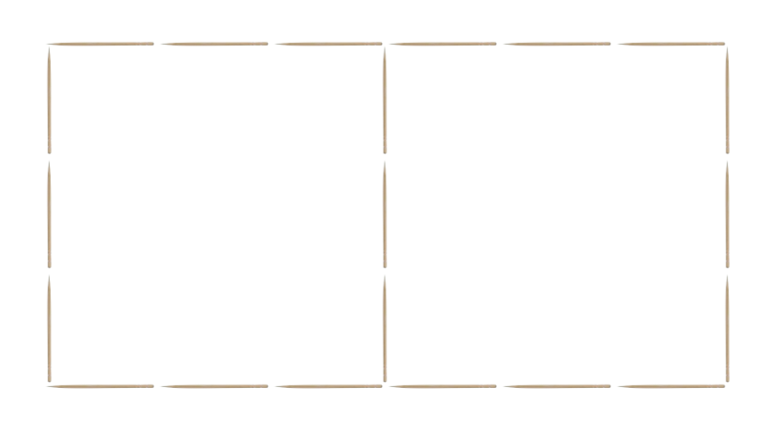

Computing With Functions
========================

So far, most of the functions you've used in CodeWorld have been of a simple
form.  The right-hand sides each consisted of a single expression, and
evaluating the function was just a matter of one substitution, and a few easy
simplifications.  All functions work by substitution in this way, but you can
do a surprising amount of computation by writing more complex functions!

In this part, we'll look at how to perform more powerful computations in
CodeWorld.

CodeWorld as a Calculator
=========================

A lot of computation starts with arithmetic.  When building expressions for
linear and non-linear change, you performed arithmetic already by following
patterns for different kinds of motion.  But CodeWorld can also be used just
for arithmetic on its own.  You can write arithmetic expressions in your
code, and build programs to show the answer.

The trick is to use the `printed` function, which turns a number into
`Text`.  Here's an example:

    program = drawingOf(lettering(printed(answer)))
    answer  = 7 * 8

If you run this program, you'll see "56" on the screen.

Precedence
----------

The same technique can be used for more complex expressions, such as:

    program = drawingOf(lettering(printed(answer)))
    answer  = 36 * (3 + 7) - 24 + 5^2

When evaluating expressions, it's important to be careful about how the
expression breaks down into subexpressions, based on the rules of operator
precedence.  These rules are sometimes known as the order of operations.
They are as follows:

1. Subexpressions that are inside a pair of matching parentheses, or between
   commas for the same list or tuple, always stay together, regardless of
   other precedence.  For example, in `(5 + 2) * 7`, `5 + 2` is a
   subexpression because it's surrounded by matching parentheses.  Similarly,
   the point `(2 + 2, 5 * 3)`, the first component (`2 + 2`), and the second
   component (`5 * 3`), are separated by the comma.
2. Exponents, written using the `^` operator, bind strongest to the
   expressions to their immediate sides.  For example `5 * 2 ^ 2` means
   the same thing as `5 * (2 ^ 2)`, and does *not* mean the same as
   `(5 * 2) ^ 2`.  The `^` operator holds onto the `2`s first, and the
   entire subexpression `2 ^ 2` is multiplied by 5.  If there is more than
   one `^` operator in a row, they are grouped toward the right, so `3^3^3`
   means the same thing as `3^(3^3)`, and has a value of `3^27`, or about
   seven and a half trillion!
3. Multiplication and division, written using `*` and `/`, are next in line.
   So `1 + 3 / 4` means `1 + (3 / 4)`, and *not* `(1 + 3) / 4`.  If there
   are multiple multiplications and divisions next to each other, they are
   grouped toward the left.  (This only matters for division, though, since
   multiplication is associative.)
4. Addition and subtraction, written using `+` and `-`, hold most weakly to
   their adjacent expressions.  If there are multiple of these next to each
   other, they are grouped toward the left.  (This only matters for
   subtraction, since addition is associative.)

Notice that this is the priority order for which operators hold most tightly to
the expressions around them.  When decomposing an expression into its
subexpressions, the *opposite* order applies.  In other words, in the example
earler, `36 * (3 + 7) - 24 + 5^2` is an *addition*: it adds the subexpression
`36 * (3 + 7) - 24` to the subexpression `5^2`.  Do you see why?  Expressions
break into subexpressions in the opposite order as above, so expressions break
apart first at addition or subtraction points, from right to left.

Recursion
=========

Finding the values of arithmetic expressions is definitely a kind of
computation, but it's a limited kind.  An important tool for doing more powerful
computations is called recursion.

Adding numbers
--------------

To see this, let's look at a story about Carl Gauss.  Carl Gauss would
eventually be one of the greatest mathematicians in history, but this story is
about his experience in elementary school!  According to legend, one of his
teachers assigned him the task of adding up all the numbers from 1 to 100,
expecting to keep him busy for some time.  Carl Gauss, though, found a clever
way to solve the problem by dividing the numbers into pairs that each add to 101
(1 and 100, 2 and 99, 3 and 98, etc.), and quickly realized that the answer was
just 50 times 101, or 5050.

Alas our computer is not so clever.  But it can do math very fast!  It could try
to beat Gauss in this computation race, by doing more work but doing it much
faster!

Here's our first attempt:

    program = drawingOf(lettering(printed(answer)))
    answer  =  1 +  2 +  3 +  4 +  5 +  6 +  7 +  8 +  9 +  10 +
              11 + 12 + 13 + 14 + 15 + 16 + 17 + 18 + 19 +  20 +
              21 + 22 + 23 + 24 + 25 + 26 + 27 + 28 + 29 +  30 +
              31 + 32 + 33 + 34 + 35 + 36 + 37 + 38 + 39 +  40 +
              41 + 42 + 43 + 44 + 45 + 46 + 47 + 48 + 49 +  50 +
              51 + 52 + 53 + 54 + 55 + 56 + 57 + 58 + 59 +  60 +
              61 + 62 + 63 + 64 + 65 + 66 + 67 + 68 + 69 +  70 +
              71 + 72 + 73 + 74 + 75 + 76 + 77 + 78 + 79 +  80 +
              81 + 82 + 83 + 84 + 85 + 86 + 87 + 88 + 89 +  90 +
              91 + 92 + 93 + 94 + 95 + 96 + 97 + 98 + 99 + 100

If you try this, you get the right answer: 5050.  But although the computer
itself did the computation in the blink of an eye, Gauss would have been done before
we could even write all that code!  And it gets worse: if you want to know the
numbers up to 1000, Gauss can use his same trick to find 500 pairs, each adding
to 1001, and get 500500.  But we'd have to write a program 10 times as long!

Is there a better way?  Indeed, there is!  The first thing we need to do is
*generalize* the question into one that has easy examples, and hard examples.
For this question, we can ask: "What is the sum of all the numbers from 1 up to
some bigger number?"  The answer *depends* on the bigger number, so it's a
function:

    sumFromOneTo(n) = ???

But how would you write this function?  The trick is to write *two* equations.

* The first equation is the **base case**.  It answers the question when it's
  *small* enough to be obvious.
* The second equation is the **general case**.  It answers the question when
  it's bigger, by *reducing* it to a smaller question of the same type.

Here's what this looks like for Gauss's problem:

    program = drawingOf(lettering(printed(answer)))
    answer  = sumFromOneTo(100)

    sumFromOneTo(1) = 1
    sumFromOneTo(n) = sumFromOneTo(n - 1) + n

To add the numbers from 1 to 1 is easy: there is only one number, so there's
nothing to add.  To add the numbers from 1 to `n`, where `n` is bigger than 1,
you can sum all the numbers up to `n - 1` (a smaller problem), and then add
`n` to the end.

By the way, the numbers you can get by adding everything from 1 to some bigger
number are called *triangle* *numbers*.

Factorials
----------

We can one-up Carl Gauss even further.  His clever trick worked fine for adding
numbers, but what about multiplying them?  There doesn't seem to be any such
trick for multiplying the numbers from 1 to n.  Our computer can still do it
quickly, though.

Multiplying all the numbers from 1 to n gives you the so-called *factorial* of
n, and it comes up in a lot of useful mathematics.  Most importantly, if you
have some items, and want to know how many different orders you could arrange
them in, the answer is the *factorial* of the number of items.  So if you have
three different items, you can put them into six orders, because
`1 * 2 * 3 = 6`.

(Can you pick three things, and find all the orders?  After playing with the
possibilities, do you see why the factorial gives the number of ways?)

It's easy to use the same technique as we used for triangle numbers, and
multiply instead to find the factorial.  We get something like this:

    factorial(1) = 1
    factorial(n) = factorial(n - 1) * n

If you play with this, you might notice that the factorial gets very large, very
quickly!  Think about this: a deck of cards has 52 cards in it.  That means if
you shuffle cards, there are `factorial(52)` different orders you could end up
with.  That might seem like a lot, but it's more than the total number of
*atoms* in a *billion* stars!

Now you can try to work out exactly *how* big factorials can get.

Recursion Mistakes
------------------

There are two mistakes that are common when using recursion.

The first mistake is to forget a base case.  A *base* *case* is the equation
that solves small versions of the question.  You need to handle enough base
cases that eventually, any problem will be reduced to a base case.

The second mistake is not to reduce the problem to a *smaller* version of the
problem.  For example, it wouldn't do any good to assert that
`sumFromOneTo(n) = sumFromOneTo(n + 1) - (n + 1)`, because that *increases* the
size of the question!  Remember, the problem needs to keep getting smaller, and
eventually reach the base case.

Fractals
--------

Recursion helps you solve some problems with arithmetic, but it's also useful
for other types, such as pictures.  When you apply recursion to a picture, you
can construct very detailed pictures quickly by following the same pattern at
different scales.

Think of a tree with its branches.  There's a single trunk, which is connected
to smaller branches off to the sides.  But each of these branches is shaped a
lot like a smaller tree.  You can build a tree from smaller trees, just like
you could build a larger sum from smaller sums.

Pictures that are made up of smaller copies of themselves in this way are called
*fractals*.  In a sense, they are infinitely complicated!  So the computer can't
draw them in full detail, because it would never finish.  Remember, recursion
needs a *base case* to stop at!  For that reason, when drawing a fractal, you'll
always need to choose a *depth*, which should decrease for every smaller piece.

Here's an example of a fractal that draws a tree:

    program = drawingOf(tree)

    tree = branch(7)

    branch(0) = blank
    branch(n) =
        polyline([(0,0), (0, 5)]) &
        translated(smallBranch, 0, 5) &
        translated(rotated(smallBranch,  30), 0, 2.5) &
        translated(rotated(smallBranch, -30), 0, 2.5)
      where smallBranch = scaled(branch(n-1), 0.5, 0.5)

Notice how there's still a *base case*, where a `branch` with depth 0 is just
a blank picture.  The *general case* describes what a branch looks like, in
terms of simpler branches with lower depth.

### Other fractals ###

There are lots of pictures besides the tree shown here that can be drawn using
fractals!  Here are some more well-known fractals:

#### The Koch curve ####

This is a curve made up of four copies of itself.  Arranging three of these in
a triangular pattern can make a nice snowflake pattern.

    program = drawingOf(kochCurve(5))

    kochCurve(0) = polyline([(-6, 0), (6, 0)])
    kochCurve(n) = translated(sub, -4, 0) &
                   translated(sub,  4, 0) &
                   translated(rotated(sub,  60), -1, sqrt(3)) &
                   translated(rotated(sub, 300),  1, sqrt(3))
      where sub  = dilated(kochCurve(n-1), 1/3)

#### Sierpinski's triangle ####

This pattern starts with a triangle, and then repeatedly removes the center to
leave three smaller triangles.

    program = drawingOf(sierpinski(8))

    sierpinski(0) = solidPolygon([(0, 8), (7, -4), (-7, -4)])
    sierpinski(n) = translated(sub, -3.5, -2) &
                    translated(sub,  3.5, -2) &
                    translated(sub,  0.0,  4)
      where sub  = dilated(sierpinski(n-1), 1/2)

### General pattern ###

When you explore your own fractals, it can be useful to use this pattern, with
blanks filled in using pictures or numbers of your choice.

    fractal(0) = leaf
    fractal(n) = joint
               & _______________ branch _______________
               & _______________ branch _______________
      where branch = dilated(fractal(n-1), ____)

    leaf  = ___________________________________________
    joint = ___________________________________________

Usually only one of `leaf` or `joint` will be filled in.  The blanks around
the branch variables can be filled in with translations and rotations that
arrange the parts into the larger whole.  You may choose to have any number
of branches in your fractal with different translations and rotations.

All of the fractals in this section can be made by following this pattern.  For
example, the tree had `blank` as the leaf, and a line segment as the joint.  On
the other hand, Sierpinski's triangle had triangles as the leaves, and blank
pictures for the joints.

Computing with Lists
====================

Recursion is a very flexible and useful technique for computation.  But it isn't
always the easiest or clearest way to say what you want.  Another useful
technique is to first make a list of the parts of your computation, and then
operate on the list.

For example, CodeWorld already provides a function to add up the numbers in a
list, using a function called `sum`.  Here's another way to solve the problem we
investigated earlier, adding the numbers from one to one hundred.

    total = sum([1 .. 100])

That almost feels like cheating!  But it's always better to write in a clear and
easy to read manner, and use the capabilities the computer already has.

Reducing a List
---------------

There are a number of functions that are provided by CodeWorld to combine the
elements of a list.  We will call these list *reducers*.  The `sum` function
mentioned above is one example of these.  Here's a longer list of options.

* `product` and `sum` can be used to multiply or add a list of numbers.
* `maximum` and `minimum` will find the largest or smallest number from a list.
* `joined` and `joinedWith` combine pieces of text, sometimes with a separate
  (like `","`) between parts.
* `concatenation` combines a list of lists into just one list with all the same
  elements.
* `pictures`, which you learned in the previous part, combines a list of
  pictures by overlaying them with `&`.

You can even invent your own reducers, and we'll look at how to do that later.
For now, this will be enough to get started.

Can you rewrite the `factorial` function from above, but use a list reducer
instead of recursion?

Using List Comprehensions
-------------------------

The next step in computing with lists is to perform computations with the
elements of a list separately.  The tool you'll use for this is one you already
have seen: *list comprehensions*.  In the previous part, though, you wrote list
comprehensions only to generate pictures.  You can also use list comprehensions
on numbers and other types, as well.

Here's an example of using a list comprehension together with a reducer to
answer a question.

Suppose you want to arrange toothpicks to form an `I` shape on the table,
like this:

With 25 toothpicks, what is the largest area you can fit inside the `I`, so that
it's bounded on three sides?  If you like, try playing with this problem
yourself before proceeding.

### Mapping and reducing ###

If you experiment, you will find you can make the width any number of toothpicks
up to 12.  If you tried more than 12, you would run out of toothpicks before
even starting the vertical line.  If `w` is the number of toothpicks wide you
choose, then it takes `2 * w` toothpicks to  create both the top and bottom
lines.  Whatever is left over is the height.  The area is the width times the
height.

One way to solve this problem is to just try all these possibilities, and then
take the largest area you get.  That's easy with a list comprehension.

    program = drawingOf(lettering(printed(answer)))
    answer = maximum([ w * (25 - 2 * w) | w <- [1 .. 12] ])

If you run this program, the answer is 78 square toothpicks.  (That comes from an
`I` shape that is 6 toothpicks wide, and 13 tall.)

Let's summarize what we did.

* First, we analyzed the problem to decide what the parts are.
* Second, we constructed a list out of each of those parts, and used a list
  comprehension to compute each part separately.
* Finally, we used a list reducer, `maximum`, to combine those parts into a
  final answer.

In this case, the parts were possibilities, and we chose the maximum from those
possibilities.  But that won't always be the case.  Other times, you might break
down a problem into parts that need to be added, or multiplied, or combined in
some other way.

This pattern is very useful for a lot of computations!  It's not just used for
computations inside a program, but also to perform massive computations across
tens of thousands of computers to run big web sites like Google and Facebook!
Definitely worth remembering.

### Filters ###

This section is still in progress.

Example: Toothpick problem with three vertical lines.

Quantifiers
-----------

This section is still in progress.

Example: computing primes

Dealing With Text
-----------------

This section is still in progress.

Basic idea: to analyze text, use `characters` to break up into characters, then
`joined` to put them back together again.

Combining Recursion and Lists
=============================

This section is still in progress.

Pattern Matching and Recursion
------------------------------

This section is still in progress.

Example: Building a custom list reducer.

Sorting
-------

This section is still in progress.
